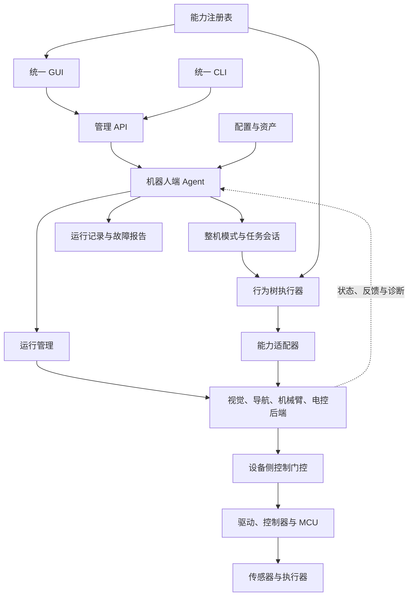
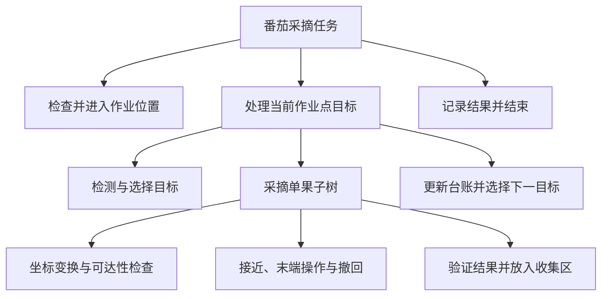

# 农业机器人系统集成框架：架构蓝图

## 1. 定位与已确定的选择

面向中大型农业机器人，提供统一的后端接入、系统配置、可视化任务设计、部署运行、诊断与实验记录入口

首个对外完整案例为番茄采摘机器人；Atlas 仅作为内部实现分析参考，不进入默认示例、产品概念与入门教程

| 项目 | 架构决定 |
|---|---|
| 默认任务引擎 | BehaviorTree.CPP |
| 整机模式 | 独立状态机，管理待命、手动、自动、标定、故障等模式 |
| 后端接入 | 能力描述、执行适配器、运行描述、接入验证组成接入包 |
| GUI | 系统搭建、任务设计、运行调试三个工作区 |
| 机器人端管理 | 轻量 Agent，提供管理 API、状态汇总、配置与任务管理 |
| 运行基础 | Linux 进程优先由 systemd 管理；ROS launch 管理组内节点 |
| 能力通信 | ROS 2 优先，兼容原生库、独立进程及网络服务 |
| MCU 接入 | 主机端通信网关适配串口/CAN 等协议 |
| 远程管理 | 首期通过 SSH 隧道连接管理 API |
| 首期 GUI 基础 | Electron 独立桌面窗口，复用 SerialArm-Core 的主题、导航与表单风格，终端按后续阶段接入 |

这是目标架构与接入规范，表中的接口和功能不代表现有仓库已经实现

## 2. 总体架构



图中的箭头表示管理或调用关系，不表示 GUI、Agent 或行为树参与实时控制周期

| 层次 | 职责 | 主要边界 |
|---|---|---|
| 交互层 | 后端配置、任务编辑、状态观察、操作请求 | 界面关闭不等于系统停止 |
| 管理层 | 运行管理、配置校验、任务会话、记录 | 不直接生成实时电机控制指令 |
| 编排层 | 行为树任务执行、恢复策略、数据绑定 | 调用能力接口，不侵入后端算法 |
| 能力层 | 统一导航、感知、操作与电控语义 | 适配现有后端，实现反馈、结果和取消 |
| 控制层 | 运动控制、通信、限位、看门狗和设备保护 | 最终检查控制权限与执行条件 |

管理 API 与机器人能力接口分开：前者面向 GUI/CLI，后者面向任务执行器和后端；图像与点云等高带宽数据走专用数据通道，管理 API 返回流地址和必要元数据

## 3. 从后端到可视化节点的接入链路

接入过程统一为：后端实现能力 → 接入包描述能力 → 注册与验证 → GUI 生成节点和表单 → 用户绑定后端实例 → 行为树执行器调用适配器

### 3.1 接入包组成

| 内容 | 必须提供的信息 |
|---|---|
| 包声明 | 标识、来源、支持的平台、契约兼容性、适配器入口 |
| 能力描述 | 能力标识、用途、输入输出、参数、反馈、结果与错误 |
| 配置模型 | 字段类型、单位、范围、默认值、是否必填、是否需要重启 |
| 运行描述 | 主机、启动停止方式、进程管理者、依赖、资源和健康检查 |
| 执行适配器 | 请求发送、结果转换、超时、取消和断线处理 |
| 界面扩展 | 可选专用页面；缺省使用框架生成的表单与状态卡片 |
| 接入验证 | 正常执行、非法参数、超时、取消、断线与资源冲突 |

导入接入包首先进行静态校验；适配器是可执行代码，只有通过明确的安装或启用操作才加载，不因打开任务文件而执行

### 3.2 能力契约

所有耗时能力必须提供可追踪的执行实例，并区分请求接受与实际执行完成

| 字段 | 约定 |
|---|---|
| capability_id | 稳定的能力标识，例如 manipulation.move_to_pose |
| backend_instance | 具体后端实例，例如 arm_left |
| input / output | 有类型的数据，必要时包含坐标系、时间戳、单位与目标 ID |
| parameters | 配置模型定义的可编辑参数 |
| preconditions | 当前模式、设备状态、数据新鲜度与资产要求 |
| resources | 使用的设备资源及共享或独占方式 |
| feedback | 当前阶段、进度与诊断信息 |
| result | 成功、失败、取消或结果未知，以及结构化原因 |
| timeout | 超时后的取消、停止确认与故障处理策略 |
| cancellation | 是否支持取消、如何请求、如何确认完成 |
| retry_policy | 哪些错误允许重试，是否可能产生不可重复的副作用 |

建议执行状态为 ACCEPTED、RUNNING、CANCELING、SUCCEEDED、FAILED、CANCELED、UNKNOWN

设备失联后若无法确认动作结果，进入 UNKNOWN，不能把它伪装成成功或直接自动重试；执行结果与设备安全状态分别记录

ROS 接入建议：耗时操作使用 Action，短时查询和设置使用 Service，连续状态使用 Topic；非 ROS 后端通过适配器遵守相同业务契约

### 3.3 各系统如何进入 GUI

| 系统 | 任务节点示例 | 配置与状态界面 |
|---|---|---|
| 视觉 | 检测番茄、估计位姿、验证采摘结果 | 相机、模型、阈值、图像、结果与处理频率 |
| 导航 | 导航到作业点、检查定位、受控底盘微调 | 地图、作业点、定位状态与导航进度 |
| 机械臂 | 移动到观察位、检查可达性、规划、执行轨迹 | Profile、模型、关节、工具坐标系与控制状态 |
| 电控 | 夹持、释放、查询末端反馈、读取设备状态 | 网关、设备映射、电源、传感器与故障 |
| 作业服务 | 选择目标、记录采摘、查询剩余任务 | 目标台账、尝试次数、结果与人工确认 |

全新系统需要开发者提供适配器和描述；已满足规范的接入包可以由集成人员在 GUI 中完成配置

机械臂自由度、基座与工具坐标系由项目声明，不固定为六轴或 link6；现有控制器和 MCU 继续维护各自的控制实现

## 4. GUI 与行为树的对应关系

### 4.1 三个工作区

| 工作区 | 页面与主要操作 | 保存结果 |
|---|---|---|
| 系统搭建 | 添加后端、绑定设备与主机、配置依赖、导入资产、检查连接 | 系统配置与后端绑定 |
| 任务设计 | 节点库、树画布、输入输出绑定、参数、子树、校验 | 标准行为树 XML 与独立布局信息 |
| 运行调试 | 系统总览、任务操作、节点状态、日志、设备视图、故障报告 | 配置快照、执行事件与任务结果 |

操作人员默认看到简化的作业页面；集成人员进入系统搭建与任务设计；开发者可展开接口、端口、树节点和诊断详情

### 4.2 行为树编辑规则

- 控制节点表达执行顺序、选择、重试与并发；能力节点表达可调用操作；条件节点表达可检查条件
- 任务引用能力角色，例如 picking_arm；系统配置将角色绑定到具体后端实例
- 父子关系决定执行逻辑，端口映射决定数据传递；数据绑定单独展示，不把行为树画成任意连线的流程图
- Blackboard 是任务执行期间的数据空间；已采摘目标与不可重复操作记录由持久化作业服务管理
- 专用节点语义和类型转换由注册表声明，不能仅凭端口名称推断
- 运行实例绑定不可变的任务与配置快照；编辑草稿不改变正在执行的任务
- 暂停、恢复只有后端和任务真正支持时才开放

画布保存标准 BehaviorTree.CPP XML，节点布局和展示信息另存；自定义能力类型通过框架注册，不能承诺所有专用类型都能直接由外部编辑器理解

### 4.3 运行前校验

| 校验类别 | 检查内容 |
|---|---|
| 结构 | 树根、节点子节点数量、子树引用与递归引用 |
| 接口 | 节点注册、契约兼容性、后端绑定与必填参数 |
| 数据 | 类型、输入来源、作用域、坐标系、单位和有效期 |
| 运行 | 主机可达、模块就绪、设备新鲜状态和资产匹配 |
| 资源 | 已知并发分支的资源冲突与资源获取策略 |
| 执行 | 超时、取消、重试资格和结果未知的处理 |

静态校验无法证明全部运行条件；执行端必须再次检查权限、状态、数据有效期与资源占用

## 5. 运行管理、模式与控制权限

### 5.1 进程与任务分别管理

启动系统完成模块启动与就绪检查，进入待命；开始任务才进入自动作业

每个进程或进程组只设一个管理者：例如 systemd 管理 ROS launch 进程，launch 管理节点；Agent 发出管理请求，不另行重复启动同一驱动

进程存在、接口可达、数据新鲜、允许动作分别展示；就绪条件按能力和当前作业阶段判断，不强制所有模块等待定位完成

### 5.2 模式与取消

整机模式是待命、手动、自动、标定、故障等状态；急停状态独立显示，不能通过 GUI 切换模式绕过设备侧急停

取消链路为：GUI 发出请求 → 任务执行器停止派发新动作 → 适配器请求取消 → 后端执行规定停止过程 → 汇总停止确认 → 更新任务结果

节点 halt 只触发取消处理；不能把树停止等同于设备已停止；超时未确认时显示停止未确认并进入项目定义的处置流程

### 5.3 资源与控制门控

- 导航、底盘微调、手动调试共享底盘控制资源；机械臂运动、拖拽和标定共享相应机械臂资源
- 资源获取使用明确的超时与顺序，避免动作持有部分资源后无限等待
- 每台设备的最终控制网关执行控制权检查，可使用租约或带代次的授权令牌拒绝过期请求
- 人工接管先撤销自主控制权；旧任务和旧进程的后续请求不能继续生效
- 服务重启后重新验证状态，禁止自动重放之前的运动指令
- 硬件急停、看门狗和设备保护由控制器与 MCU 实现；软件门控补充业务约束

GUI 断开后，自主任务由机器人端按既定策略管理；遥操作失联触发设备侧超时停止；关闭窗口、取消任务、停止系统是三个独立操作

## 6. 配置、标定与运行记录

### 6.1 配置所有权

| 类型 | 示例 | 所有者 |
|---|---|---|
| 项目默认配置 | 模块组成、接口、默认任务 | 项目接入包 |
| 设备与现场配置 | 主机、串口、相机序列号、地图 | 部署实例 |
| 后端原生配置 | 机械臂 Profile、控制器参数 | 对应后端，框架通过适配器编辑或引用 |
| 标定资产 | 内参、手眼变换、零位、工具变换 | 资产管理 |
| 作业策略 | 重试次数、目标选择、收集位置 | 作业方案 |
| 任务定义 | 子树、端口映射与恢复策略 | 任务包 |
| 界面布局 | 节点位置、面板折叠 | GUI |

同一参数只有一个权威来源；GUI 与 CLI 使用相同的校验和应用路径，不额外维护一套运行参数

标定资产保存适用设备、源与目标坐标系、测量条件、来源、校验值与验证记录；不匹配的资产不能通过修改文件名被当作有效标定

### 6.2 应用流程

编辑草稿 → 校验 → 查看差异 → 判断生效条件 → 应用 → 记录实际生效结果

多模块配置变更不假定具备原子性：需要停止或分阶段应用的配置必须声明顺序，失败时记录部分生效状态并执行可支持的回退

每次运行保存软件来源、最终配置、任务树、资产校验值、后端绑定、执行事件、目标台账、结果与关联数据

离线回放使用隔离的运行目标与只读或模拟适配器，禁止获得真机设备控制权

## 7. 番茄采摘机器人完整案例

### 7.1 系统组成

| 角色 | 接入内容 | 关键资产 |
|---|---|---|
| 导航 | 底盘驱动、定位与导航后端 | 地图、定位与底盘配置 |
| 感知 | 相机、番茄检测与位姿估计 | 内参、检测模型、手眼标定 |
| 操作 | SerialArm-Core，按需要接入规划后端 | URDF、Profile、基座与工具变换 |
| 末端 | MCU 通信网关与末端控制 | 设备映射、执行与反馈参数 |
| 作业 | 目标筛选、采摘验证、持久化台账 | 区域、观察位、收集位置与策略 |

### 7.2 任务模板



这是任务分解示意，具体 Sequence、Fallback、循环与恢复节点在模板实现时明确；不存在目标、单果失败、整个区域完成必须使用不同的业务结果，避免混为普通 FAILURE

视觉位姿必须携带坐标系、时间戳和目标 ID，经已验证的变换得到机械臂输入；实际采摘前再次确认数据新鲜度和目标状态

遮挡、不可达等任务级问题可按策略换视角或跳过；通信故障和停止未确认中止相应操作；结果未知要求重新观测或人工确认，禁止盲目重试

作业台账至少记录目标 ID、观测、尝试次数、操作 ID、成功/失败/未知结果；“动作返回成功”和“番茄已采摘”分别判断

## 8. 建议工程结构

```text
framework/
  contracts/          能力、配置、运行与任务契约
  registry/           接入包发现与能力注册
  agent/              管理 API、模式、会话与状态汇总
  runtime/            进程与 ROS 生命周期适配
  task_engine/        BehaviorTree.CPP 执行与节点注册
  adapters/           通用通信及后端适配器
  gui/                系统搭建、任务编辑、运行调试
  assets/             配置与标定资产管理
  records/            事件、作业台账与故障报告
  deployment/         安装、部署与服务配置
  examples/
    tomato_picker/    对外完整案例
  docs/               接入规范、使用说明与开发指南
```

这是逻辑模块划分；初期可在一个仓库中实现，不要求每个目录成为独立服务

建议管理核心使用 Python、行为树执行器使用 C++、GUI 使用复用既有组件的 Web 技术栈；是否包装为桌面应用在核对 SerialArm-Core 现有实现后确定

## 9. 落地顺序与验收

| 阶段 | 交付 | 验收 |
|---|---|---|
| 第一阶段 | 契约、注册表、模拟后端、最小 Agent/CLI 与行为树执行 | 导入能力，绑定实例，执行与取消；非法参数与结果未知可识别 |
| 第二阶段 | 系统搭建 GUI、配置与资产管理、任务模板参数界面 | 通过 GUI 配置番茄机器人并运行模拟采摘闭环 |
| 第三阶段 | 完整行为树画布、端口绑定、子树、校验与运行观察 | 编辑、保存、加载和执行保持语义一致；运行实例使用固定快照 |
| 第四阶段 | 视觉、导航、机械臂、电控真机适配 | 分系统验证后完成真实采摘；资源、接管与停止规则通过验证 |
| 第五阶段 | 多主机部署、实验记录、回放、故障报告与可支持的回退 | 换设备可重复部署，故障可追溯，回放不产生真机输出 |

每个阶段都验证缺失设备、启动缓慢、重复启动、后端崩溃、GUI 断线、配置变更、取消超时、并发资源冲突、过期数据与重复操作

## 10. 架构冻结边界

现在冻结：BehaviorTree.CPP 默认任务引擎、独立整机模式、能力接入契约、后端实例绑定、三个 GUI 工作区、配置所有权、设备侧门控和番茄采摘对外案例

实现前继续细化：具体消息类型、错误码、XML 节点映射、资源协议、现有 GUI 组件可复用范围，以及番茄末端的执行反馈与停止能力

这些细节在接入规范和案例验证中收敛，不改变已经确定的分层结构
