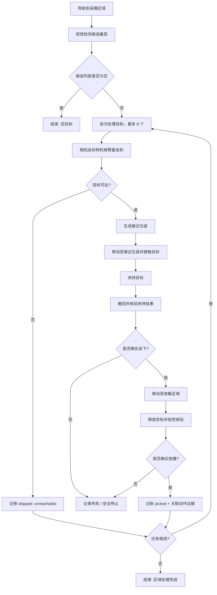

# 番茄采摘机器人 · 可导入完整示例

这是一份用于演示系统集成的 **MockWorld 状态模拟**；不是默认机器人系统，也不是 Gazebo / Isaac Sim 物理仿真；只能从工作台「总览 → 新建机器人系统 → 从示例创建」建立独立机器人实例

## 包含内容

| 子系统 | 后端实例 | 主要能力 | 模拟执行者 |
| --- | --- | --- | --- |
| 导航 | `navigation` | 到达作业区 | `tomato_simulator.navigation` |
| 视觉 | `vision` | 检测候选番茄、核验采摘与放置 | `tomato_simulator.vision` |
| 机械臂 | `arm` | 坐标变换、可达性、接近、转运 | `tomato_simulator.arm` |
| 电控/末端 | `control` | 夹持、释放、作业记录 | `tomato_simulator.control` |

四个后端独立拥有生命周期和状态，但共享同一 MockWorld，保证视觉、机械臂与电控看到的是同一颗番茄，不用分别伪造成功反馈

## 完整任务逻辑

> 上述图是用户可读的逻辑摘要；准确执行拓扑以 `tasks/harvest.xml` 为准，不应将示意流程图作为第二套执行逻辑

## 文件到 GUI 的对应关系

| 文件 | 用户在 GUI 中的体现 |
| --- | --- |
| `package.yaml` | 模拟接入包及 12 项能力 |
| `system_four_backends.yaml` | 导入后生成四个后端与角色绑定，自动赋予当前实例独立 `system_id` |
| `assets/camera_to_arm.json` | 模拟相机到机械臂基座变换证据，不代表真实设备标定 |
| `tasks/harvest.xml` | 带 `Harvest / PickFruit` 子树的完整行为树 |
| `tasks/harvest.task.json` | 有限目标上限、参数、资产和超时限制 |
| `tasks/harvest.layout.json` | 供编辑器使用的视图布局（不影响动作顺序） |

## 从零使用

1. 运行 `./install.sh`、`./launch.sh`，在总览选择「新建机器人系统」
2. 选择「从示例创建」，填入系统名称，点击「创建并选择系统」
3. 总览确认加载了四个模拟后端，在「系统搭建」查看它们的角色绑定
4. 在「任务编排」选择当前系统的番茄采摘任务模板，保存参数方案；或将示例复制到行为树编辑器检查子树与数据绑定
5. 进入「运行调试」，启动系统并等待四个后端 READY，执行预检、开始任务，观察运行结果
6. 在「记录与报告」检查单果结果、动作事件和停止确认，完成后停止系统
7. 返回总览，可新建另一个系统或选择已有系统；停止未确认时不允许切换

## 预期结果与安全边界

- 可达候选且各步骤确认成功：单果结果为 `picked`，携带执行证据
- 不可达候选：记 `skipped`，不派发该目标的夹爪动作
- 视觉候选为空：无夹取动作，任务记录空目标结果
- 放置核验失败或取消：不能记为成功；保留错误原因与停止状态
- 真机运动、碰撞、力反馈、外部传感器和在线标定均未模拟，P4 需要对应真实适配器另行验收
- 当前模板 `max_recovery_attempts: 0`，不对物理动作自动重试；不把控制命令已接受误报为任务成功
